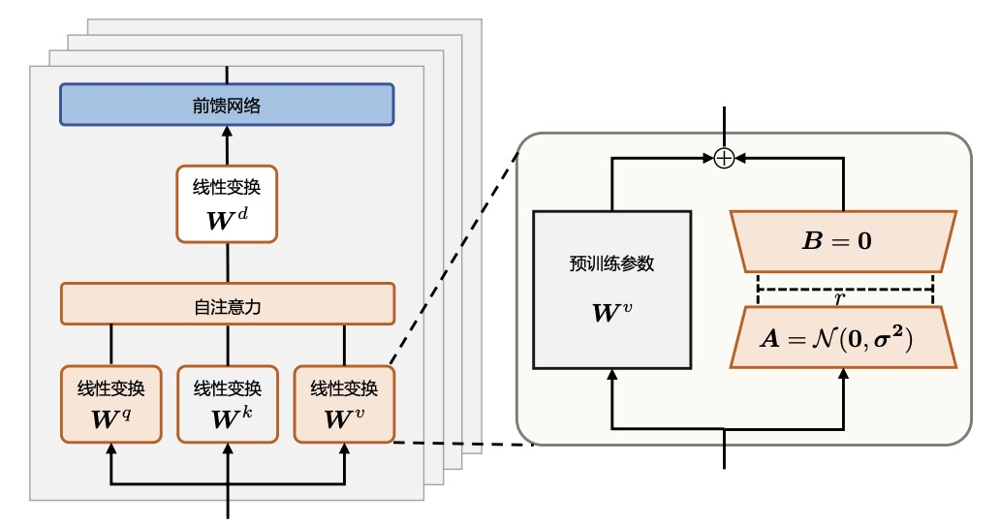
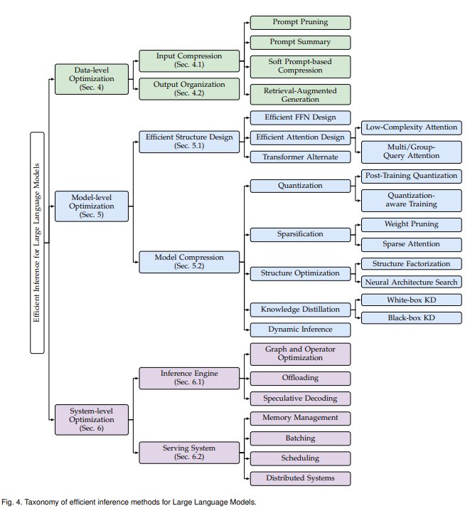

<h1 style="display: flex; justify-content: space-between; align-items: center;">
  
</h1>

# LLM/MLLM论文讨论内容整理
将接触到的部分科研讨论话题整理如下，以供日常科研参考

---

## 📰 News
😎 关于面向表格智能的LLM（大型语言模型）相关工作，详细收录可见于[Awesome-Tabular-LLMs](https://github.com/SpursGoZmy/Awesome-Tabular-LLMs)

---

## 🚀 Content

### [多模态大模型相关](#多模态大模型相关)
- [多模态大模型介绍](#多模态大模型介绍)
- [多模态大模型重要问题](#多模态大模型重要问题)
    - [多模态大模型幻觉](#🤪-多模态大模型幻觉)
- [多模态大模型重要应用](#多模态大模型重要应用)
    - [多模态仇恨言论检测](#多模态仇恨言论检测)

### [大模型高效优化与扩展](#大模型高效优化与扩展)
- [大模型Scaling-Laws与实用推广](#🧐大模型scaling-laws与实用推广)
- [大模型参数高效训练](#🎮大模型参数高效训练)
- [大模型显存高效训练](#大模型显存高效训练)
- [大模型推理高效](#🌟大模型推理高效)

### [大模型知识处理](#大模型知识处理)
- [大模型知识推理](#大模型知识推理)
- [大模型知识编辑](#大模型知识编辑)
- [大模型知识蒸馏](#大模型知识蒸馏)
- [大模型可解释性](#大模型可解释性)
- [大模型幻觉](#大模型幻觉)

### [大模型文本的处理与对齐](#大模型文本的处理与对齐)
- [大模型的长文本处理](#大模型的长文本处理)
- [大模型的人类偏好对齐](#大模型的人类偏好对齐)
- [大模型文本水印技术](#大模型文本水印技术)

### [大模型架构](#大模型架构)

---

## 多模态大模型相关
### 多模态大模型介绍
Coming Soon...

### 多模态大模型重要问题
Coming Soon...

### 🤪 多模态大模型幻觉

> **多模态幻觉**通常指"The discrepancy between generated text response and provided visual content"。简单地说，指模态之间的不一致性。（导致忽略了事实正确性）例如，在图像标题生成任务中，生成的标题包含了图像中不存在的事物。

> 现阶段，多模态幻觉可被分为以下几类：

- 1.Category(类别幻觉):模型“发现”了图中不存在的物体

- 2.Attribute(属性幻觉):模型对于图中的物体的属性(属性包括，形状，颜色，数量等)有着错误的理解

- 3.Relation(关系幻觉):模型对于图中物体的关系没有正确理解。例如，模型将茶几和沙发的关系理解为茶几放在沙发上

更多基础知识可见于[(参考综述)](https://arxiv.org/abs/2404.18930)

<b> 论文列表 </b> 

+ **话题:多模态幻觉**

| 标题 | 类型 | 会议  | 日期 |
| ------ | :---: | :---: | :---: |
| **Hallucination of Multimodal Large Language Models: A Survey** [[paper]](https://arxiv.org/abs/2404.18930)[[project]](https://github.com/showlab/Awesome-MLLM-Hallucination) | 综述 | arxiv | 2024-04-29 |
| **A Survey on Hallucination in Large Vision-Language Models**  [[paper]](https://arxiv.org/abs/2402.00253)[[project]](https://github.com/lhanchao777/LVLM-Hallucinations-Survey) | 综述 | arxiv | 2024-05-06 |
| **Evaluating Object Hallucination in Large Vision-Language Models** [[paper]](https://arxiv.org/abs/2305.10355)[[project]](https://github.com/RUCAIBox/POPE) | 多模态幻觉评估 | EMNLP2023 | 2023-05-17 |
| **MME: A Comprehensive Evaluation Benchmark for Multimodal Large Language Models** [[paper]](https://arxiv.org/abs/2306.13394)[[project]](https://github.com/BradyFU/Awesome-Multimodal-Large-Language-Models/tree/Evaluation) | 多模态幻觉评估 | arxiv | 2023-06-23 |
| **Aligning Large Multimodal Models with Factually Augmented RLHF** [[paper]](https://arxiv.org/abs/2309.14525)[[project]](https://llava-rlhf.github.io/) | 多模态幻觉缓解,多模态幻觉评估 | arxiv | 2023-09-25 |
| **OPERA: Alleviating Hallucination in Multi-Modal Large Language Models via Over-Trust Penalty and Retrospection-Allocation** [[paper]](https://arxiv.org/abs/2311.17911)[[project]](https://github.com/shikiw/OPERA) | 多模态幻觉缓解 | **CVPR 2024 Highlight** | 2023-09-29 |
| **Less is More: Mitigating Multimodal Hallucination from an EOS Decision Perspective** [[paper]](https://arxiv.org/pdf/2402.14545)[[project]](https://github.com/yuezih/less-is-more) | 多模态幻觉缓解 | ACL 2024 | 2024-02-22 |

### 多模态大模型重要应用
Coming Soon...

#### 多模态仇恨言论检测
Coming Soon...

## 大模型高效优化与扩展
### 🧐大模型Scaling-Laws与实用推广

+ `基础知识`:

> + **Scaling Laws** 是指模型性能（如损失、精度）与模型规模（如参数数量$N$、训练数据量$D$、计算资源$C$）之间的经验性关系。关键要点包括：

> 1. **参数数量$N$**：模型性能随参数增加提升，但增幅逐渐减小。
> 2. **数据量$D$**：更多数据能提升大模型性能。
> 3. **计算量$C$**：更多计算资源能带来更好的训练效果。
> 4. **损失函数$L$**：随着资源投入增加，损失函数呈现次幂缩减趋势。
> 5. **应用**：Scaling Laws 主要用于指导模型的设计与训练，使得资源的投入能够带来最佳的性能提升。比如通过 Scaling Laws，研究人员可以预估增加参数、数据或计算是否会有效提升模型性能，从而更合理地分配资源，推动开发更大规模的模型。

> + Scaling Laws不仅是一种针对大模型训练的理论积累，还是一种实践方法，可以迁移到各种需要估计数据量、数据比例、参数量（或其他概念）的大模型训练场景（即，找自己研究场景里的Scaling Laws）。

<b> 论文列表 </b> 

+ **话题:Scaling Laws与实用推广**

| 标题 | 类型 | 会议  | 日期 |
| ------ | :---: | :---: | :---: |
| **Scaling laws for neural language models** [[paper]](arxiv.org/abs/2001.08361) | Scaling Laws | OpenAI技术报告 | 2020-01-23 |
| **Training Compute-Optimal Large Language Models** [[paper]](https://arxiv.org/abs/2203.15556) | 有关大模型参数量，数据量和计算量的Scaling Laws | NIPS2022 | 2022-03-29 |
| **Scaling Laws with Vocabulary: Larger Models Deserve Larger Vocabularies** [[paper]](https://arxiv.org/abs/2407.13623) [[project]](https://github.com/sail-sg/scaling-with-vocab) | 有关大模型词表的Scaling Laws | arxiv | 2024-07-18 |
| **D-CPT Law: Domain-specific Continual Pre-Training Scaling Law for Large Language Models** [[paper]](https://arxiv.org/abs/2406.01375) | Continual Pre-Training的Scaling Laws | arxiv | 2024-06-03 |
| **Observational Scaling Laws and the Predictability of Language Model Performance** [[paper]](https://arxiv.org/abs/2405.10938) [[project]](https://github.com/ryoungj/ObsScaling)| 在多个Model Family，多个Benchmark上总结的通用Scaling Laws | arxiv | 2024-05-17 |

### 🎮大模型参数高效训练

+ `基础知识`:

>  + **概念简介**:由于大语言模型参数量十分庞大，当将其应用到下游任务时，微调全部参数需要相当高的算力。为了节省成本，研究人员提出了多种参数高效（Parameter Efficient）的微调方法，旨在仅训练少量参数使模型适应到下游任务。

>  + **参数高效方法分类**:当前应用最频繁的参数高效微调方法当属LoRA及其变体(如QLoRA,AdaLoRA等)。除此之外，典型的参数高效微调方法还有基于Adapter的方法(如[Adapter tuning](https://arxiv.org/pdf/1902.00751))和基于前缀微调的方法(如[Prefix Tuning](https://arxiv.org/abs/2101.00190))

>  + **典型参数高效微调方法举例——**[LoRA](https://arxiv.org/abs/2106.09685),是当前被广泛应用于LLM训练的参数高效微调方法。LoRA方法流程为:固定预训练模型参数不变，在原本权重矩阵旁路添加低秩矩阵的乘积作为可训练参数(见下图),用以模拟模型参数的变化量。

>  + 模型参数变化量的计算公式为:  $W = W_0 + B \cdot A$  (其中$B$, $A$为低秩矩阵。初始化时，矩阵 $A$ 通过高斯函数初始化，矩阵 $B$ 为零初始化，使得训练开始之前旁路对原模型不造成影响)

   

 

>  + LoRA在实际微调大模型时具有良好效果，并且由于参数合并，不会带来额外推理时延。后续的相关工作也尝试改进LoRA，将其应用到更广泛的实际任务中。

<b> 论文列表 </b> 

+ **话题:复用和组合LoRA模组 for few/zero shots learning**

| 标题 | 类型 | 会议  | 日期 |
| ------ | :---: | :---: | :---: |
| **Few-Shot Parameter-Efficient Fine-Tuning is Better and Cheaper than In-Context Learning** [[paper]](https://arxiv.org/abs/2205.05638)[[project]](https://github.com/r-three/t-few) | Adapter Tuning, 多任务学习 | NIPS2022 | 2022-08-26 |
| **Combining Parameter-efficient Modules for Task-level Generalisation** [[paper]](https://aclanthology.org/2023.eacl-main.49/)[[project]](https://github.com/microsoft/mttl) | LoRA组合, 多任务学习 | EACL2023 | 2023 |
| **LoraHub: Efficient Cross-Task Generalization via Dynamic LoRA Composition** [[paper]](https://arxiv.org/abs/2307.13269)[[project]](https://huggingface.co/lorahub) | LoRA组合, 多任务学习 | COLM2024 | 2023-07-25 |
| **Towards Modular LLMs by Building and Reusing a Library of LoRAs** [[paper]](https://arxiv.org/abs/2405.11157)| LoRA组合, 多任务学习 | ICML2024 | 2024-05-18 |
| **Learning to Route Among Specialized Experts for Zero-Shot Generalization** [[paper]](https://arxiv.org/abs/2402.05859) [[project]](https://github.com/r-three/phatgoose)| LoRA组合, 多任务学习 | ICML2024 | 2024-02-08 |

### 大模型显存高效训练
Coming Soon...

### 🌟大模型推理高效

+ `基础知识`:

>  + **概念简介**:大语言模型的落地应用受到其较大的推理开销的限制，对部署资源、用户体验、经济成本都带来了巨大挑战。例如，将LLaMA-2-70B模型进行部署推理，至少需要6张RTX 3090Ti显卡或2张NVIDIA A100显卡，以部署在A100显卡上为例，该模型生成512长度的词块（token）序列需要耗时超过50秒。因此，设计优化大语言模型推理开销的技术，成为许多研究的重要目标。

>  + 大语言模型在实际部署应用中，人们通常关注其**延时、吞吐、功耗和存储**，而在大语言模型推理过程中，有三个重要因素会直接影响上述效率指标，分别是**计算开销（Computational Cost）**、**访存开销（Memory Access Cost）**和**存储开销（Memory Cost）**。[现有综述](https://arxiv.org/abs/2404.14294)总结出影响上述指标的三点根本因素，分别为：

> 1. **模型规模**：主流大语言模型庞大的模型规模会导致巨大的计算量、访存量和存储量。
> 2. **注意力算子**：作为大语言模型的核心算子，注意力算子具有与输入长度呈平方关系增长的计算和存储复杂度。
> 3. **解码方式**：主流的自回归解码方式导致极低的计算-访存比和硬件利用率，同时动态增长的KV cache[(如不了解KV cache，可参考此简介)](https://zhuanlan.zhihu.com/p/662498827)会导致碎片化的内存使用，对访存开销和存储开销带来增长。

>  + 针对上述因素，从推理高效角度出发的现有技术可大致分为三类[(分类依据)](https://arxiv.org/abs/2404.14294):

> 1. **数据层优化技术**：（技术典型:Prompt压缩）指通过优化输入提示词或规划模型输出内容优化推理效率。这类优化技术通常不需要修改模型本身，因此避免了大量的模型训练或微调开销；
> 2. **模型层优化技术**：（技术典型:模型剪枝）指通过设计高效的模型结构或模型压缩技术优化推理效率。这类技术通常需要对模型进行预训练或微调来恢复任务精度，同时通常对输出结果是有损的；
> 3. **系统层优化技术**：（技术典型:算子优化，猜测解码）指通过优化推理引擎或服务系统优化推理效率。这类技术通常不需要额外的模型训练开销，同时可以保证对输出结果是无损的。

   

 

更多基础知识可见于[(参考综述)](https://arxiv.org/abs/2404.14294)

<b> 论文列表 </b> 

+ **话题:使用超网络生成PEFT模块(涉及内容归属：数据层优化技术)**
> + **话题简介**:超网络（Hypernetworks）表示用于产生网络参数的网络。LLM推理速度受限于冗长的指令和少样本示例。用超网络为instruction/few-shot demonstration生成PEFT模块,则无需每次处理输入prompt。（需注意，此话题下的技术可以按多种理论视角解读，既可以视为一种能增益大模型推理效率的soft prompt技术，也可以视为一种参数高效的大模型优化方法。）

| 标题 | 类型 | 会议  | 日期 |
| ------ | :---: | :---: | :---: |
| **HyperPrompt: Prompt-based Task-Conditioning of Transformers** [[paper]](https://arxiv.org/abs/2203.00759) | 多任务学习 | ICML2022 | 2022-03-01 |
| **Prototype-based HyperAdapter for Sample-Efficient Multi-task Tuning** [[paper]](https://arxiv.org/abs/2310.11670)[[project]](https://github.com/Bumble666/PHA) | 多任务学习 | EMNLP2023 | 2023-10-18 |
| **HyperTuning: Toward Adapting Large Language Models without Back-propagation** [[paper]](https://arxiv.org/abs/2211.12485)| 大模型参数高效训练 | ICML2023 | 2022-11-22 |
| **HINT: Hypernetwork Instruction Tuning for Efficient Zero- & Few-Shot Generalisation** [[paper]](https://arxiv.org/abs/2212.10315)[[project]](https://github.com/allenai/hyper-task-descriptions) | 大模型推理高效 | ACL2023 | 2022-12-20 |

+ **话题:从稀疏性角度看LLM推理加速(涉及内容归属：模型层优化技术，系统层优化技术)**

| 标题 | 类型 | 会议  | 日期 |
| ------ | :---: | :---: | :---: |
| **Deja Vu: Contextual Sparsity for Efficient LLMs at Inference Time** [[paper]](https://arxiv.org/abs/2310.17157)[[project]](https://github.com/FMInference/DejaVu) | 大模型推理高效 | ICML2023 | 2023-10-26 |
| **Sheared LLaMA: Accelerating Language Model Pre-training via Structured Pruning** [[paper]](https://arxiv.org/abs/2310.06694)[[project]](https://github.com/princeton-nlp/LLM-Shearing) | 大模型剪枝 | ICLR2024 | 2023-10-10 |
| **Fluctuation-based Adaptive Structured Pruning for Large Language Models** [[paper]](https://arxiv.org/abs/2312.11983)[[project]](https://github.com/CASIA-IVA-Lab/FLAP) | 大模型剪枝 | AAAI2024 | 2023-12-19 |
| **PERP: Rethinking the Prune-Retrain Paradigm in the Era of LLMs** [[paper]](https://arxiv.org/abs/2312.15230)[[project]](https://github.com/ZIB-IOL/PERP) | 大模型剪枝 | arxiv | 2023-12-23 |
| **LLaMA-MoE: Building Mixture-of-Experts from LLaMA with Continual Pre-training** [[paper]](https://arxiv.org/abs/2406.16554)[[project]](https://github.com/pjlab-sys4nlp/llama-moe) | LLM MoE | arxiv | 2024-06-24 |

## 大模型知识处理
### 大模型知识推理
Coming Soon...

### 大模型知识编辑
Coming Soon...

### 大模型知识蒸馏
Coming Soon...

### 大模型可解释性
Coming Soon...

### 大模型幻觉
Coming Soon...

## 大模型的文本处理与对齐
### 大模型的表格处理

### 大模型的长文本处理
Coming Soon...

### 大模型的人类偏好对齐
Coming Soon...

### 大模型文本水印技术
Coming Soon...

## 大模型架构
Coming Soon...